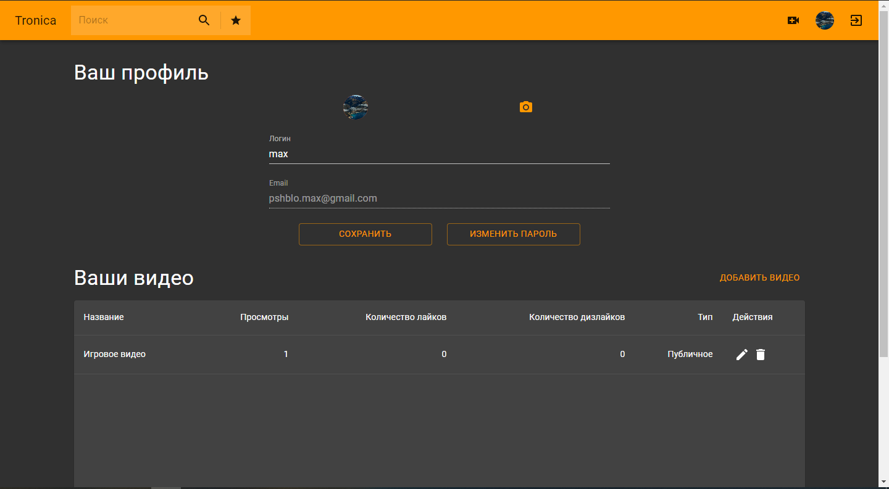

# Курсовая работа по предмету Web-программирование

Работа представляет собой аналог видео хостинга как youtube. Почти весь основной функционал ютуба был реализован.

Реализована система администрирования, то есть пользователь с правом администратора может удалять и видео, и комментарии, и пользователей.

Также есть возможность создать приватное видео: оно не будет появляться на главное странице и в поиске, доступ только по ссылке.

### Код

Backend часть: https://github.com/Makunika/video-hosting

Серверная часть написана на языке Java с использованием фреймворка spring boot.
В качестве базы данных использована СУБД PostgreSQL.

Клиентская часть написана с помощью React на языке JavaScript с использованием фреймворка Material Design.

### Скриншоты работы

Главная страница:

Страницы регистрации и входа:

Страница просмотра видео:

Страница личного профиля:

Страница загрузки нового видео:

Страница профиля пользователя, доступное всем:

Страница профиля пользователя, доступное всем:

Страница профиля пользователя, доступное всем:

Если вы зашли под администратора, то у вас появляются дополнительные кнопки на некоторых страницах:

Сайт имеет адаптивность на всех страницах:

